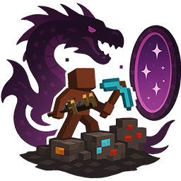

<h1 align="center">HiroServer Launcher</h1>

    

### **<ins>
Fonctionnalitées du launcher :
**

- ✅ Mise à jour automatiques.

- 🔒 Authentification Microsoft.

- 📰 Fil d'actualité intégré nativement au launcher.

- ⚙️ Gestion intuitive des paramètres, y compris un panneau de configuration Java.

- 🟢 Statut serveur complet.

  - Opérationnel ou hors ligne.

  - Nombres de joueurs connectés.

- ☕ Installation de Java automatique.

  - Si vous avez installé une version incompatible de Java, nous installerons la bonne pour vous.

  - Vous n'avez pas besoin d'avoir Java installé pour exécuter le launcher.

Ce n'est pas une liste exhaustive. Installez le launcher pour voir tout ce qu'il peut faire !

Vous aimez le projet ? Laissez une étoile ⭐ sur le repo !

---

### **<ins>
Téléchargement :
**

Vous pouvez télécharger le launcher à partir des [Releases GitHub](../../../releases).

Plateformes supportées :

- Windows
- Linux
- MacOS

Si vous téléchargez à partir des Releases, sélectionnez le programme d'installation de votre système.

| Plateforme  | Fichier                               |
| ----------- | ------------------------------------- |
| Windows x64 | `Hiro-Launcher-win-x64.exe `          |
| macOS x64   | `Hiro-Launcher-mac-x64.dmg`           |
| macOS arm64 | `Hiro-Launcher-mac-arm64.dmg`         |
| Linux x64   | `Hiro-Launcher-linux-x86_64.AppImage` |

---
